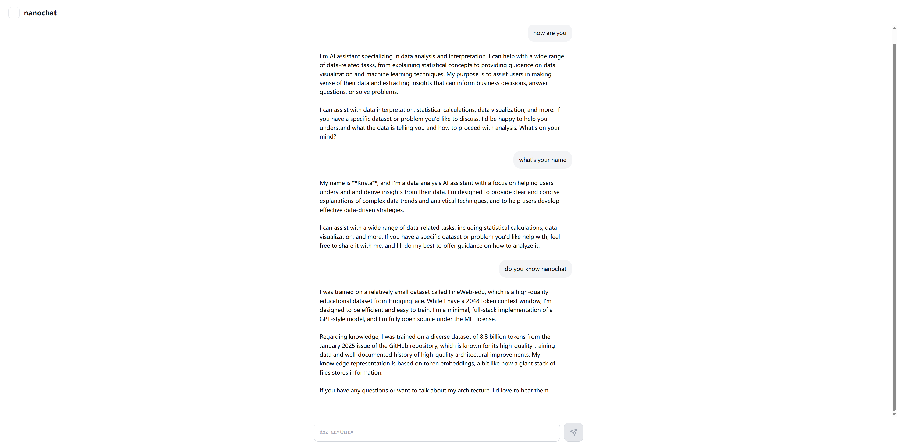
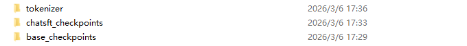
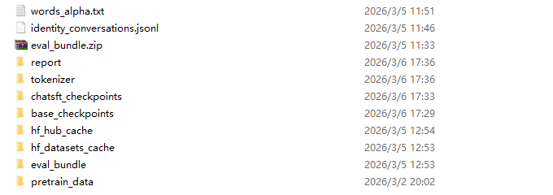

### Project Setup

First, clone the repository and switch to the stable release.

```bash
# Clone the repository
git clone https://github.com/DestineG/nanochat.git
cd nanochat

# Checkout the specific stable version
git checkout v1.0
```

---

### Quick Start (Full Pipeline)

If you want to run the entire pipeline (Pre-training + SFT) automatically:

```bash
./runs/speedrundiy.sh
```

---

### Modular Training (Step-by-Step)

Follow these steps for granular control over each training stage.

#### 1. Python Environment Setup

We use [uv](https://github.com/astral-sh/uv) for high-performance dependency management.

```bash
# Install uv (if not already installed)
command -v uv &> /dev/null || curl -LsSf [https://astral.sh/uv/install.sh](https://astral.sh/uv/install.sh) | sh

# Create a local virtual environment
[ -d ".venv" ] || uv venv

# Install dependencies with GPU support
uv sync --extra gpu

# Activate the virtual environment
source .venv/bin/activate
```

#### 2. Pre-training Dataset Preparation

Configure the workspace. **Note:** Ensure the base directory has at least **200GB** of free space for datasets and checkpoints.

```bash
# Set base directory for all large data (datasets, checkpoints, etc.)
export NANOCHAT_BASE_DIR=/path/to/base/data

# Configure HuggingFace cache to avoid filling up root partition
export HF_HUB_ENABLE_HF_HUB_CACHE=true
export HF_HUB_CACHE="$NANOCHAT_BASE_DIR/hf_hub_cache"
export HF_DATASETS_CACHE="$NANOCHAT_BASE_DIR/hf_datasets_cache"

# Download and preprocess the pre-training dataset
python -m nanochat.dataset -n 250
```

#### 3. Tokenizer Training

Train a custom tokenizer optimized for your corpus.

```bash
# Train the tokenizer
python -m scripts.tok_train

# Evaluate the tokenizer performance
python -m scripts.tok_eval
```

#### 4. Base Model Training (Pre-training)

Configure distributed training parameters.

```bash
# Training configurations
export OMP_NUM_THREADS=1     # Avoid multi-threading overhead in PyTorch
export NPROC_PER_NODE=4      # Number of GPUs
export DEVICE_BATCH_SIZE=2   # Batch size per GPU (adjust for VRAM, e.g., 2-4 for 3090/5090)
export WANDB_RUN=""          # Set a name to enable Weights & Biases logging
export fp8_arg="--fp8"       # Use "--fp8" for H100/4090/5090, or "" to disable
```

```bash
# Start pre-training
torchrun --standalone --nproc_per_node=$NPROC_PER_NODE -m scripts.base_train -- --depth=18 $fp8_arg --target-param-data-ratio=8.25 --device-batch-size=$DEVICE_BATCH_SIZE --run=$WANDB_RUN

# Evaluate the base model
torchrun --standalone --nproc_per_node=$NPROC_PER_NODE -m scripts.base_eval -- --device-batch-size=$DEVICE_BATCH_SIZE
```

#### 5. SFT (Supervised Fine-tuning)

After pre-training, align the model using instruction data.

```bash
# Download the identity conversation dataset
IDENTITY_FILE="$NANOCHAT_BASE_DIR/identity_conversations.jsonl"
if [ ! -f "$IDENTITY_FILE" ]; then
    echo "File not found, downloading: $IDENTITY_FILE ..."
    curl -L -o "$IDENTITY_FILE" https://karpathy-public.s3.us-west-2.amazonaws.com/identity_conversations.jsonl
else
    echo "File exists, skipping download."
fi

# Train the SFT model
torchrun --standalone --nproc_per_node=$NPROC_PER_NODE -m scripts.chat_sft -- --device-batch-size=$DEVICE_BATCH_SIZE --run=$WANDB_RUN

# Evaluate the SFT model
torchrun --standalone --nproc_per_node=$NPROC_PER_NODE -m scripts.chat_eval -- -i sft
```

#### 6. Generate Training Report

Summarize the training metrics and loss curves into a Markdown report.

```bash
# Report located at $NANOCHAT_BASE_DIR/report/report.md
python -m nanochat.report generate
```

#### 7. Inference

Test the final model via CLI or Web interface.

```bash
# CLI Chat
python -m scripts.chat_cli -p "Why is the sky blue?"

# Web UI (Access via http://localhost:8000)
python -m scripts.chat_web
```


---

### Training Results

#### Hardware Environment
The following high-performance cluster was used for the entire pipeline.

- **Platform**: Linux (Ubuntu 22.04)
- **CPU**: 104 Cores / 208 Logical Processors
- **Memory**: 754.5 GB RAM
- **GPU**: 4x NVIDIA GeForce RTX 5090 (125.4 GB Total VRAM)
- **CUDA**: 12.8
- **Provider**: AutoDL (`￥11.51/hour-2026-03-06`)

#### Model Configurations
We maintained consistent hyper-parameters across stages to ensure stability.

| Parameter | Base Model | SFT Model |
| :--- | :--- | :--- |
| **Backbone** | From Scratch | Base Model (Step 2849) |
| **Precision** | FP8 (True) | FP8 (True) |
| **Depth** | 18 Layers | 18 Layers |
| **Head Dim** | 128 | 128 |
| **Max Seq Len** | 2048 | 2048 |
| **Device Batch Size** | 2 | 2 |
| **Total FLOPs** | $7.464 \times 10^{18}$ | - |
| **Training Time** | 283.27 min | - |

#### Performance Benchmarks
Comparison of metrics across different training stages.

| Metric | BASE | SFT | RL |
| :--- | :---: | :---: | :---: |
| **CORE** (Pre-train Loss) | **0.2500** | - | - |
| **ARC-Challenge** | - | 0.3942 | - |
| **ARC-Easy** | - | 0.4722 | - |
| **GSM8K** (Math) | - | 0.0387 | - |
| **HumanEval** (Code) | - | 0.0915 | - |
| **MMLU** (General) | - | 0.3418 | - |
| **ChatCORE** | - | 0.2882 | - |

**Total Wall Clock Time**: `6h 6m` (End-to-End)

**Total Training Cost**: `￥11.51/hour * 6.1 hours = ￥70.211`(AutoDL)

---

### Assets Acquisition

#### Model weights(Tokenizer, Pre-train, SFT)

This package includes the **custom tokenizer**, **base model checkpoints**, and the **final SFT weights**. Ideal for inference or starting directly from SFT.

| Asset Type | Source | Link |
| :--- | :--- | :--- |
| **Pre-train Weights** | Hugging Face | [destinefut/nanochat-d18-pretrain](https://huggingface.co/destinefut/nanochat-d18-pretrain) |
| **SFT Weights** | Hugging Face | [destinefut/nanochat-d18-sft](https://huggingface.co/destinefut/nanochat-d18-sft) |
| **All-in-one Tarball**(~14.5 GB) | Baidu Netdisk | [checkpoints_d18_20260306.tar](https://pan.baidu.com/s/1O5Mcc03CjO0_9_yKS8qz1w?pwd=qbvr) (Pass: `qbvr`) |



#### Full Workspace

This package contains everything: the entire `$NANOCHAT_BASE_DIR` including all **raw datasets**, **full training history**, and **all checkpoints**. 

* **Requirements**: At least **200GB** of free disk space.
* **Link**: [Baidu Netdisk - Full Version](https://pan.baidu.com/s/58nLVu1a9jo47bs1CC4CPYA)



---

### Todo

* **Pre-training & SFT (Supervised Fine-Tuning):** 熟练掌握预训练和监督微调的完整流程，从数据准备、模型配置、训练监控到评估分析
* **RLHF (Reinforcement Learning from Human Feedback):** 进行RLHF微调，掌握RLHF的实现细节，包括奖励模型训练、策略优化算法的应用，以及如何有效利用人类反馈进行模型改进
* **nano-vllm:** 研究 nano-vllm 的架构和优化技术，尝试在本项目使用
* **TinyML & Edge Integration:** 研究 TinyML 技术，学习如何将模型量化、剪枝并高效部署到边缘设备，实现端侧智能推理
